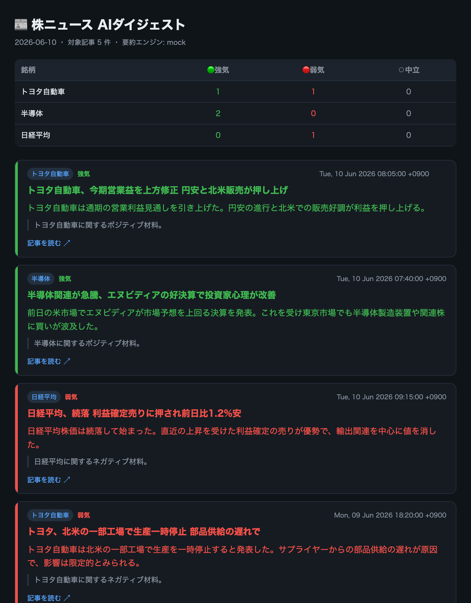

# 株ニュース AIダイジェスト（stock-news-digest）


ウォッチした銘柄の株ニュースを自動収集し、**生成AI（Claude）が要約＋強気/弱気/中立を判定**して、日次ダイジェスト（Markdown / HTML）を生成するツール。

> ⚠️ 本ツールはニュースの**情報整理**を目的とした自動生成物です。投資助言・売買の推奨・将来予測ではありません。

> **このリポジトリの本質**：「**Webスクレイピング（RSS＋記事ページ）→ 生成AIで要約・分類 → レポート自動生成**」のエンドツーエンド。要約エンジンは**差し替え式**で、APIキー不要の `mock`（0円）と本物の `claude` を1行で切り替えられる。

## 技術ハイライト

- **ニュース収集**（[`src/fetch.py`](src/fetch.py)）— `feedparser` でRSSを収集し、`requests`＋`BeautifulSoup` で記事本文をスクレイピング。ウォッチリストでの絞り込み・URL重複排除・レート制御（1req/1秒）。
- **要約エンジン（差し替え式）**（[`src/summarize.py`](src/summarize.py) / [`src/claude_summarizer.py`](src/claude_summarizer.py)）— `Summarizer` 抽象を **MockSummarizer**（ルールベース・0円）と **ClaudeSummarizer**（Anthropic公式SDK・**構造化出力でJSONを保証**）で実装。プロバイダ抽象化＝実務でよくやる設計。
- **レポート生成**（[`src/digest.py`](src/digest.py)）— 銘柄別センチメント集計＋色分けカードを Markdown / HTML で出力（XSS対策のHTMLエスケープ込み）。
- **堅牢性** — 同梱サンプルフィードでオフライン／CIでも必ず動く。pytest＋GitHub Actions CI 付き。

**使用技術**: Python / feedparser / requests・BeautifulSoup / PyYAML / Anthropic Claude API（構造化出力）

### 出力サンプル



*同梱サンプルフィード＋モック要約で生成（[examples/sample_digest.md](examples/sample_digest.md)）。Claudeに切り替えると要約・判定の質が上がる。*

## セットアップ

```bash
python3 -m venv .venv && source .venv/bin/activate
pip install -r requirements.txt
```

## 使い方

```bash
# ① 0円で試す（同梱サンプル × モック要約）
PYTHONPATH=src python -m main --sample

# ② 本物のClaudeで要約（要 ANTHROPIC_API_KEY）
export ANTHROPIC_API_KEY=sk-ant-...
PYTHONPATH=src python -m main --sample --engine claude

# ③ 実フィードから（config.yaml の feeds を設定して）
PYTHONPATH=src python -m main --engine claude --full-text
```

出力は `output/digest_<日付>.md` と `.html`。

## 毎朝の自動運用（GitHub Actions）

[`.github/workflows/daily-digest.yml`](.github/workflows/daily-digest.yml) が **毎朝7時(JST)に自動実行**され、ウォッチ銘柄の最新ニュースを集めてダイジェストを生成し、**GitHub Issueで通知**＋`digests/` に保存します。サーバー不要・公開リポジトリは無料。

- ニュースは **Google News RSS** から銘柄名で実取得（`use_google_news: true`）
- 要約は **`ANTHROPIC_API_KEY` をリポジトリのSecretに登録すると自動でClaudeに昇格**（未登録ならmockで0円運用）
- 手動実行: リポジトリの **Actions** タブ →「Daily Digest」→ Run workflow

> APIキーの登録: リポジトリ **Settings → Secrets and variables → Actions → New repository secret**（名前 `ANTHROPIC_API_KEY`）。

## 設定（config.yaml）

- `watchlist` — 追う銘柄（`name` ＋ `keywords`）
- `feeds` — 公開RSSのURL（複数可）
- `summarizer` — `mock`（0円） / `claude`
- `claude_model` — 既定 `claude-opus-4-8`。コスト重視なら `claude-haiku-4-5`（要約用途なら十分・価格は約1/5）

## 設計のポイント（差し替え式）

`get_summarizer(name)` が `mock` / `claude` を返すだけで、呼び出し側は要約エンジンを意識しない。
→ 開発・CIは**0円のmock**で回し、本番だけ**Claudeに差し替え**。「プロバイダを抽象化して差し替え可能にする」実務パターンの実例。

## ディレクトリ

```
src/
  fetch.py             # ニュース収集（RSS＋記事スクレイピング）
  summarize.py         # Summarizer 抽象 + MockSummarizer
  claude_summarizer.py # ClaudeSummarizer（Anthropic公式SDK・構造化出力）
  digest.py            # Markdown / HTML 生成
  main.py              # CLI
fixtures/sample_feed.xml   # オフライン/CIデモ用サンプルフィード
examples/                  # 出力サンプル（md / html / png）
tests/                     # pytest
```

## 注意

- スクレイピングは**公開RSS**と低頻度の記事取得に限定し、サイト負荷に配慮（1リクエスト1秒）。各サイトの robots.txt / 利用規約を尊重すること。
- 本ツールは情報整理の補助であり、**投資判断は自己責任**で。
